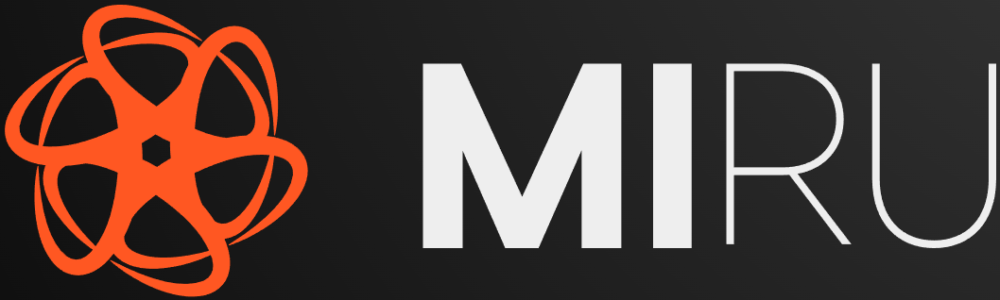

  

# Miru
Miru is a [UCI](https://en.wikipedia.org/wiki/Universal_Chess_Interface) chess engine written in C++. Miru in itself is not a complete chess program and requires a UCI-compatible graphical user interface (eg. [Arena](http://www.playwitharena.de/)). It's important to note that the engine is still under development so improvements & potential bug fixes are possible.

## Features
Huge inspiration has been taken from tutorials, stronger engines and external research. That being said, here are some of the features used:

### Board Representation
- [Bitboard representation](https://www.chessprogramming.org/Bitboards)

### Search
- [Negamax](https://www.chessprogramming.org/Negamax)
  - [Principal variation search](https://www.chessprogramming.org/Principal_Variation_Search)
- [Aspiration Windows](https://www.chessprogramming.org/Aspiration_Windows)
- [Null nove pruning](https://www.chessprogramming.org/Null_Move_Pruning)
- [Razoring](https://www.chessprogramming.org/Razoring)
- [Late move reduction](https://www.chessprogramming.org/Late_Move_Reductions)
- [MVV-LVA](https://www.chessprogramming.org/MVV-LVA)
- [Hash move/ PV/ killer/ history move ordering](https://www.chessprogramming.org/Move_Ordering)
- [Transposition table](https://www.chessprogramming.org/Transposition_Table)

### Evaluation
- [Material](https://www.chessprogramming.org/Material)
- [Piece-Square Tables](https://www.chessprogramming.org/Piece-Square_Tables)
- [Pawn Structure](https://www.chessprogramming.org/Pawn_Structure)
